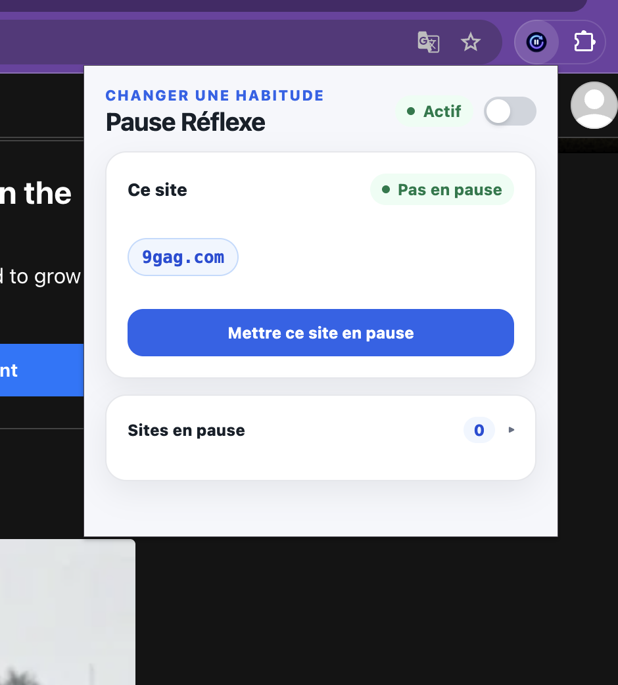
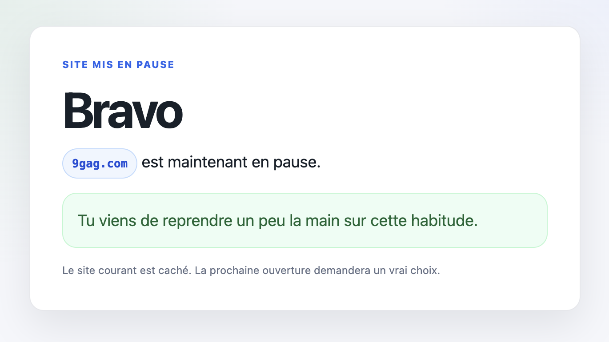
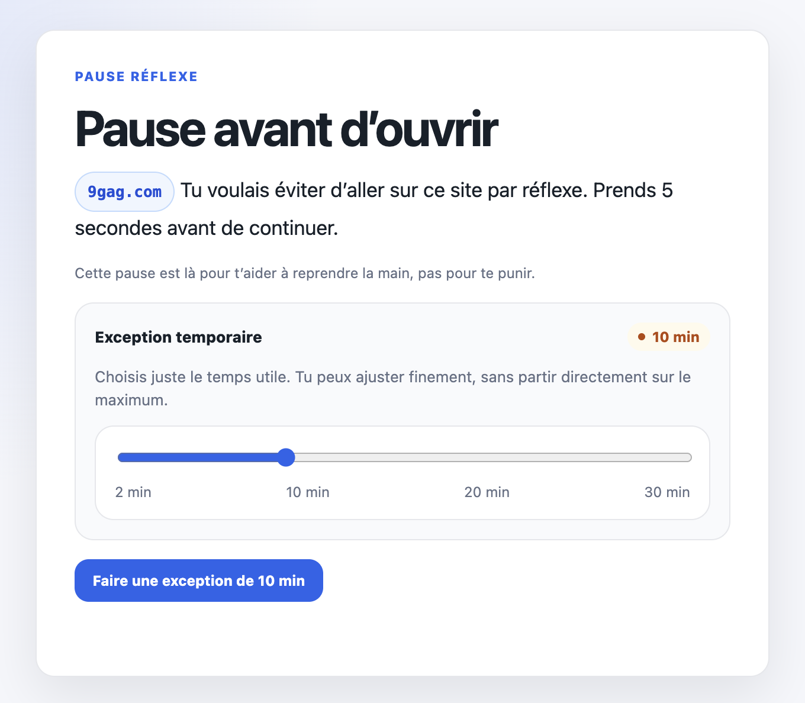
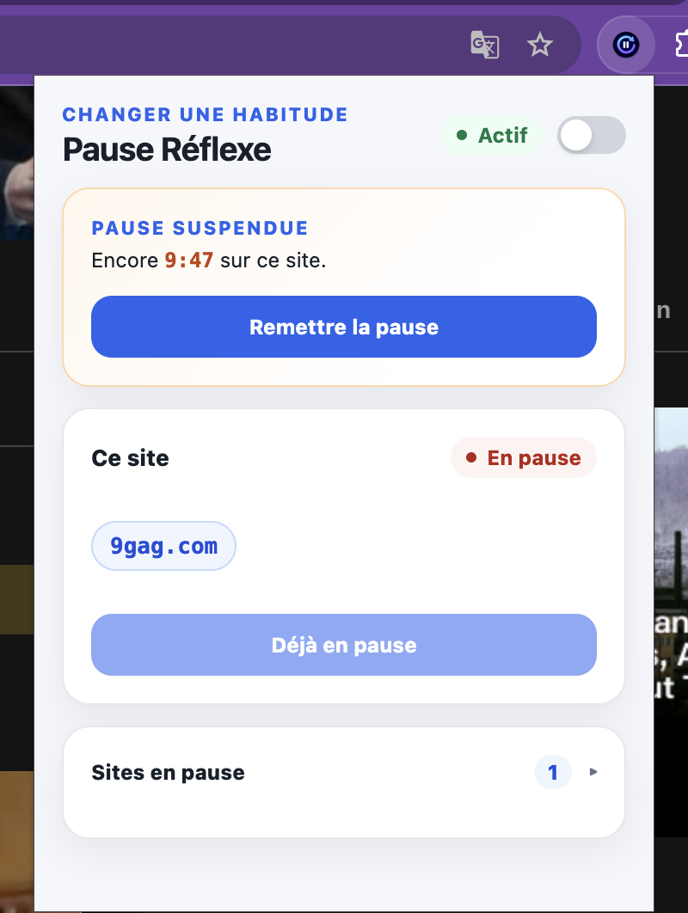

<p align="center">
  
</p>

# Pause Réflexe

Pause Réflexe est une extension navigateur pour reprendre la main sur les sites qu’on ouvre par réflexe.

Ce n’est pas un bloqueur punitif, un outil de contrôle parental ou une promesse anti-contournement. L’objectif est plus simple : créer une pause entre l’habitude et l’ouverture du site.

Quand un site est mis en pause, l’extension intercepte l’accès et affiche une question courte avant de continuer. L’utilisateur peut faire une exception temporaire, parce qu’un changement d’habitude durable doit accepter quelques écarts légers plutôt que pousser à désactiver l’extension.

## Aperçu

L’idée n’est pas de créer une cage. C’est de transformer un réflexe en décision : je mets ce site en pause, je vois le blocage quand j’y retourne, et je peux ouvrir une exception courte si j’en ai vraiment besoin. Assez de friction pour reprendre la main, assez de souplesse pour éviter la frustration qui fait tout abandonner.

<p align="center">
  
</p>

La popup permet de mettre le site courant en pause en un clic.

<p align="center">
  
</p>

Après la décision, le site est caché et l’action est renforcée positivement.

<p align="center">
  
</p>

Au prochain réflexe, l’ouverture devient un vrai choix avec une exception temporaire ajustable.

<p align="center">
  
</p>

Pendant l’exception, la popup rappelle le temps restant et permet de remettre la pause immédiatement.

## Pour qui ?

Pause Réflexe s’adresse aux personnes qui veulent réduire l’usage automatique de certains sites : YouTube, Instagram, Reddit, 9gag, réseaux sociaux, sites d’actualité, plateformes de vidéo ou de scroll infini.

La promesse produit :

> Bloquer volontairement les sites qu’on ouvre sans y penser, avec assez de souplesse pour rester utilisable dans la durée.

## Ce que l’extension ne promet pas

Pause Réflexe n’est pas conçue pour empêcher un utilisateur déterminé de contourner le blocage.

Elle ne vise pas :

- le contrôle parental ;
- le blocage administrateur inviolable ;
- la surveillance ;
- les statistiques avancées ;
- la culpabilisation.

Elle vise une friction volontaire et acceptable pour accompagner un changement d’habitude.

## Installer localement

Prérequis :

- Node.js 24 via `nvm` ;
- Chrome ou un navigateur compatible Manifest V3.

Installer les dépendances :

```bash
npm install
```

Charger l’extension dans Chrome :

1. Ouvrir `chrome://extensions`.
2. Activer le mode développeur.
3. Cliquer sur “Load unpacked”.
4. Sélectionner le dossier `src/` du dépôt.
5. Après chaque modification du service worker ou du manifeste, cliquer sur “Reload”.

## Participer au développement

Le projet est volontairement simple : une extension Manifest V3, du JavaScript modulaire, et des tests unitaires Vitest pour la logique importante.

Structure principale :

```text
src/
  background/   Service worker Manifest V3
  blocked/      Page affichée quand un site est en pause
  content/      Rappels injectés sur les pages temporairement autorisées
  icons/        Icônes de l’extension
  paused/       Page de confirmation après ajout d’un site
  popup/        Interface popup de l’extension
  shared/       Logique partagée et testable

tests/          Tests unitaires Vitest
docs/           Plans, PRD et procédures de test manuel
```

Commandes utiles :

```bash
npm run test:run
npm run validate:manifest
```

Avant de proposer une modification, vérifie au minimum :

```bash
npm run test:run
npm run validate:manifest
```

## Licence

Ce projet est distribué sous licence MIT. Voir [LICENSE](LICENSE).
